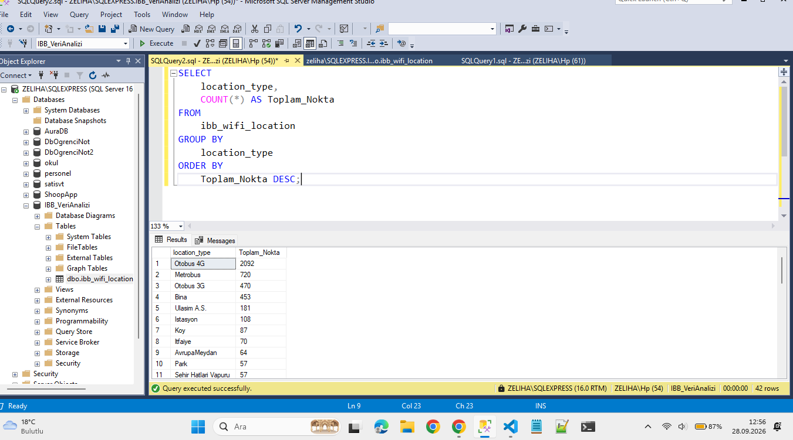
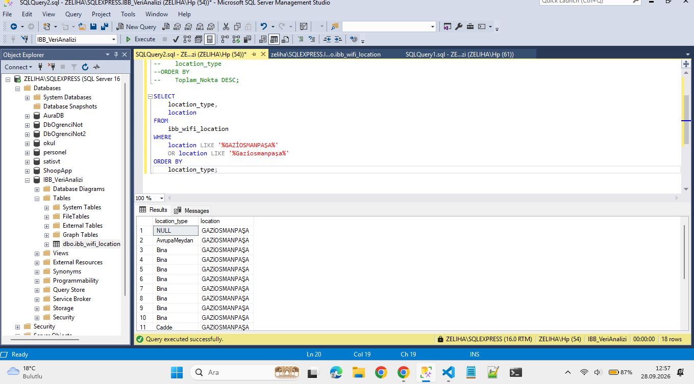

# İBB Wi-Fi Lokasyon Verileri SQL Analizi ve Raporlama

Bu proje, İstanbul Büyükşehir Belediyesi'nin (İBB) Açık Veri Portalı'ndan elde edilen kurumsal Wi-Fi lokasyon verilerinin Microsoft SQL Server Management Studio (SSMS) kullanılarak içe aktarılması, filtrelenmesi ve raporlanması amacıyla gerçekleştirilmiştir.

## 🛠️ Kullanılan Teknolojiler ve Araçlar
* **Microsoft SQL Server (SSMS):** Veritabanı yönetimi ve SQL sorgulama.
* **Data Import (Flat File):** Ham CSV verilerinin ilişkisel veritabanı tablolarına dönüştürülmesi.
* **SQL Komutları:** `SELECT`, `GROUP BY`, `COUNT`, `ORDER BY`, `WHERE`, `LIKE` filtrelemeleri.

## 📊 Gerçekleştirilen Analiz Senaryoları
1. **Genel Dağıtım Analizi:** İBB Wi-Fi hizmetinin en yoğun verildiği lokasyon türleri (`location_type`) gruplandırılarak analiz edilmiş; Otobüs 4G ve Metrobüs hatlarının ilk sıralarda yer aldığı tespit edilmiştir.
2. **Bölgesel Hedefleme (Filtreleme):** `WHERE` ve `LIKE` operatörleri kullanılarak tüm İstanbul verisi içerisinden sadece **Gaziosmanpaşa** bölgesine ait Wi-Fi noktaları cımbızla çekilmiş ve raporlanmıştır.

## 📸 SQL Sorgu ve Sonuç Ekranı
Aşağıdaki görselde, Gaziosmanpaşa bölgesine ait Wi-Fi lokasyonlarının SQL veritabanından başarıyla filtrelendiği sorgu ekranı görülmektedir:

## 📁 Rapor Çıktısı
Filtrelenen veriler dışa aktarılarak (`Export`) yönetim sunumlarına ve incelemelere uygun **CSV** formatında (`hey.csv`) depoya eklenmiştir.
